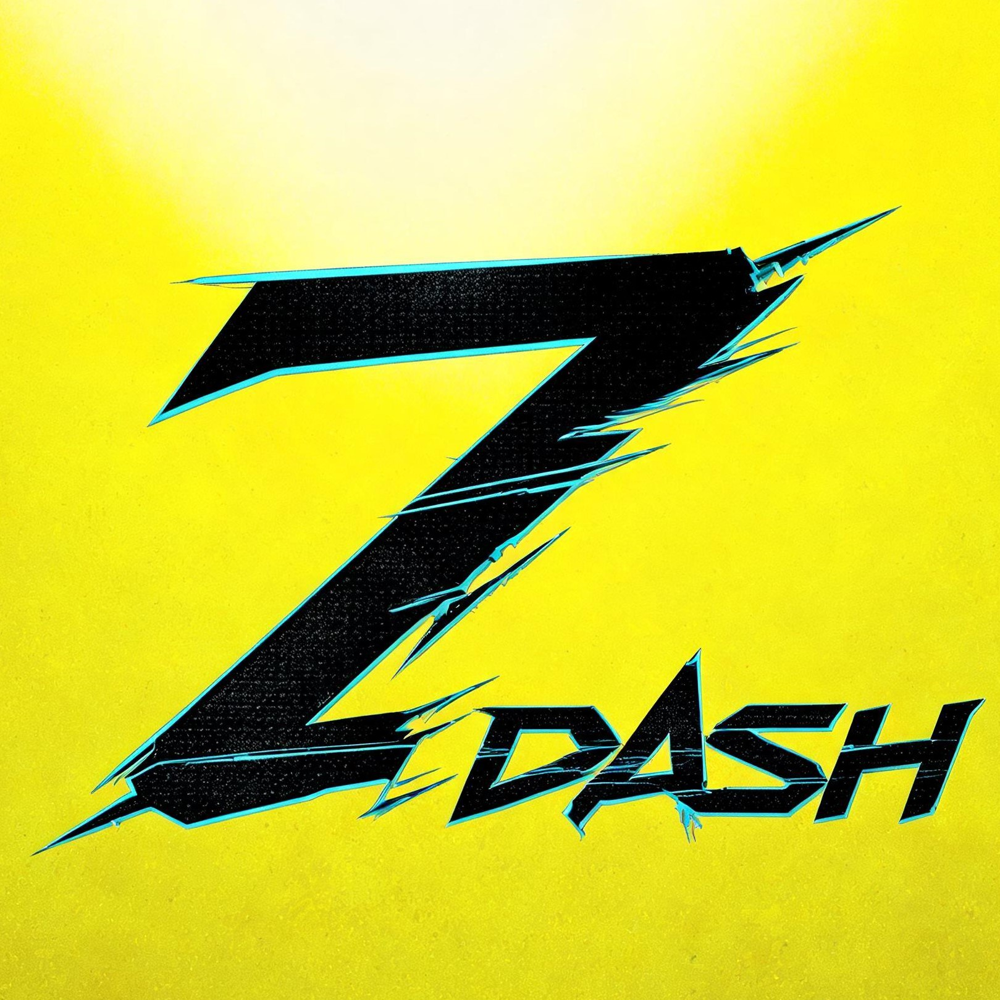

<div align="center">



# Z-DASH

**赛博朋克风 · 程序员个人工作台**

待办 · 归档 · 周报 · 链接 · 统计 · 工具 —— 一屏全收

[](https://git.io/typing-svg)

[](#license)
[](#quickstart)
[](#tech)
[](#tech)
[](#tech)
[](#desktop)

[](https://github.com/shuglx/z-dash/stargazers)
[](https://github.com/shuglx/z-dash/forks)
[](https://github.com/shuglx/z-dash/issues)
[](https://github.com/shuglx/z-dash/commits)

[简介](#intro) · [功能](#features) · [声望系统](#xp) · [快速开始](#quickstart) · [桌面版](#desktop) · [桌宠](#pet) · [License](#license)

</div>

---

<a id="intro"></a>

## 🧭 简介

> 把工作台做成一台夜之城终端：所有数据落在本地 JSON 文件里，完全属于你自己。

- **零依赖 · 零框架 · 零 CDN** —— 原生前端（HTML/CSS/JS）+ Node 内置模块，连 `npm install` 都不需要
- **数据实时落盘** —— 所有增删改即时写入 `data/*.json`（临时文件 + 原子改名，杜绝写坏）
- **响应式** —— 820px 断点：PC 侧边栏 ⇄ 移动端底部 Tab 栏
- **完全离线** —— 无任何外部资源，内网 / 飞行模式照常使用
- **游戏化激励** —— 归档任务赚 XP、攒 streak、升声望阶位，把工作台玩成游戏

| 页面 | 路由 | 一句话 |
|---|---|---|
| 📋 待办看板 | `#/todo` | 三栏拖拽看板，按项目自动分组 |
| 🗄️ 历史归档 | `#/archive` | 搜索 / 筛选 / 月历打点，完成事项全记录 |
| 📝 周报墙 | `#/weekly` | 年度周块网格，一键导入生成 Markdown 周报 |
| 🔗 常用链接 | `#/links` | 分组管理，支持任意协议 |
| 📊 数据统计 | `#/stats` | 热力图 / 图表 / 声望面板（默认页） |
| 🧰 工具抽屉 | `#/tools` | 时间戳 / JSON / 正则 / 加解密 |

---

<a id="features"></a>

## ✨ 功能一览

### 📋 待办看板 `#/todo`

- 三栏看板：未启动 TODO / 进行中 PROGRESS / 已完成 DONE
- 列内按项目自动分组（同项目归一组，未分组置底）
- 每任务含：标题（`[TAG]` 高亮）、优先级 P0-P2、项目、截止日期、可选详情 desc
- 隐藏字段：创建日期 `createdAt`、完成日期 `doneAt`（= 最后一次放入 DONE 的日期）
- PC 端拖拽切换状态；卡片箭头快捷切换：TODO 仅 `→`、PROGRESS 有 `←→`、DONE 仅 `←`
- 已完成任务卡片右上角 `ARCHIVE` 按钮（灰色边框）归档进历史（保留详情，日历按完成日期打点）
- 快捷键 `N` 新建任务

### 🗄️ 历史归档 `#/archive`

- 关键词搜索（标题 / 项目 / 详情 / 日期）
- 范围筛选按钮：全部 / 本周 / 近 1 月 / 近 3 月 + 自定义日期区间
- 月历视图：当天任务数以数字徽标显示（固定右下角），点日期过滤列表（日历标记保留）
- 记录 `[view]` 查看详情（含创建/完成/归档日期与详情）、`[del]` 删除
- 前端分页（每页 10 条）
- `↓ EXPORT REPORT` 导出当前筛选结果为 Markdown

### 📝 周报墙 `#/weekly`

- 年度周块网格：`<` `>` 切换年份，悬停显示周一~周日区间，未来周禁用，已写周高亮
- 点击周块弹层填写周报（Markdown），`COMMIT` 持久化到 `data/weekly.json`
- `↓ IMPORT TASK` 一键生成：完成项（待办 DONE / 历史归档）统一按完成日期是否落在该周区间计入，本周额外全量列出未完成任务

### 🔗 常用链接 `#/links`

- 链接增删改、点击新窗口跳转
- 每个链接必须归属某个分组（新建/编辑时必选，无 UNGROUPED）
- URL 支持任意协议（`https://`、`smb://`、`ssh://`、`mailto:` 等，需以合法协议开头）
- 分组管理：新建 / 重命名 / 折叠分组
- 删除分组前强制校验：组内链接必须先清空（移至其他分组或删除）
- 离线无 favicon，自动退化为字母方块图标
- 顶部 grep 搜索框：按名称 / URL 实时筛选，匹配分组自动展开，无结果显示空状态

### 📊 数据统计 `#/stats`

- KPI 四卡：累计归档 / 本周完成 / 进行中 / 项目数
- STREET CRED 街区声望面板：等级徽章、XP 进度、streak、下一阶位提示（`👁 阶位` 按钮可预览全部 8 个声望阶位的挂件/面板/升级弹窗效果）
- GitHub 风格完成热力图（近 53 周，按归档 doneAt 打点，自定义 tooltip，宽度自适应）
- 项目分布横向条形图（归档 + 待办合并 Top 8）
- 近 12 周完成趋势柱状图（本周高亮）

### 🧰 工具抽屉 `#/tools`

- TIMESTAMP：时间戳（秒/毫秒自动识别）⇄ 日期时间双向联动；日期用自定义日历选择器（今天高亮、时分秒循环调节、确定关闭）
- JSON：格式化 / 压缩 / 复制，错误提示
- REGEX：正则实时测试，命中高亮 + 列表（含捕获组）
- ENCODE：MD5（纯 JS 实现）/ Base64 编解码 / URL 编解码，结果一键大小写转换与复制
- 2×2 面板网格，占满视口均分无滚动

### 🌐 全局

- 快捷键：数字 `1-9` 切页、`N` 新建、`E` 编辑/查看鼠标 hover 的项
- 所有弹层支持 `Esc` 关闭
- 侧边栏 STREET CRED 挂件：声望徽章 + 等级 + XP LED 进度条 + streak（紧贴 SYS MONITOR 上方）
- 侧边栏 SYS MONITOR：CPU / 内存 / 磁盘 LED 条（`GET /api/sys`，3 秒轮询，超阈值变色）
- 页面面包屑尾部终端光标闪烁动效

---

<a id="xp"></a>

## 🏆 街区声望系统（XP）

把工作台玩成游戏：完成任务得 XP，连续归档攒 streak，优先级越高分越多。

### 计分规则

- **结算时机**：归档即结算 —— 点击任务卡 `ARCHIVE` 按钮的瞬间 XP 到账；删除归档记录则相应扣回
- **单条 XP = 优先级基础分 + streak 加成**：

| 优先级 | 基础分 |
|---|---|
| P0 紧急 | 30 |
| P1 重要 | 20 |
| P2 普通 | 10 |

| 归档当日连续工作日 | 加成 |
|---|---|
| ≥ 30 天 | +60 |
| ≥ 14 天 | +30 |
| ≥ 7 天 | +15 |
| ≥ 3 天 | +5 |

- **streak 按工作日连续**：周六/日自动跳过不算断签（周五归档 → 下周一归档 = 连续 2 天）；今天还没归档不判死，保留到当天结束；同时记录最长 streak（BEST）；断签无惩罚，仅加成清零

### 等级与阶位

- 升级所需 XP：Lv1-24 每级 `50 + 25×(L-1)`；Lv25 起每级 `710 + 85×(L-25)`（25 级后明显变陡）；封顶 Lv50
- 8 档声望阶位（徽章 + 代号 + 专属色）：

| Lv 区间 | 徽章 | 代号 | 阶位 |
|---|---|---|---|
| 1-4 | `·` | NOBODY | 无名之辈 |
| 5-9 | `▸` | ROOKIE | 街区新人 |
| 10-14 | `◆` | STREET KID | 街头小子 |
| 15-19 | `◈` | FIXER | 中间人 |
| 20-26 | `✦` | NETRUNNER | 网络黑客 |
| 27-34 | `❖` | CORPO | 企业寡头 |
| 35-44 | `★` | LEGEND | 夜之城传奇 |
| 45-50 | `Ω` | ICON | 活着的传说 |

### 反馈

- 归档 toast：`ARCHIVED → +25 XP (P1 20 + STREAK 5)`
- 升级时刻：LEVEL UP 专用弹窗（金色标题 + 新阶位徽章，LV 数字跟随阶位色）
- 侧边栏挂件实时刷新；`#/stats` 声望面板含 XP 构成（基础/加成/优先级计数）

### 数据口径

- 纯派生计算：XP / 等级 / streak 全部由 `archive.json` 实时推导，**不新增数据文件、零迁移**
- 起算锚点 `config.xpSince`（首次启动自动写入当天）：仅完成日期 ≥ 锚点的归档计分，更早的历史归档保留展示与统计、不计 XP
- 升级弹窗判据 `localStorage['zd-xp-lv']`，数据重置后自动向下同步

---

<a id="quickstart"></a>

## 🚀 快速开始

环境要求：Node ≥ 18.20.8（零第三方依赖，无需 `npm install`）。

启动脚本统一在 `bin/` 目录，覆盖三大平台：

| 平台 | 命令 | 说明 |
|---|---|---|
| macOS / Linux | `./bin/start.sh` | 启动后端 + 自动打开浏览器，Ctrl+C 停止；换端口 `./bin/start.sh 8001` |
| macOS 双击 | 双击 `bin/start.command` | 用 Terminal 打开并启动 |
| Windows | `bin\start.bat`（双击或命令行） | 服务跑在独立最小化窗口，关闭该窗口即停止 |

手动启动：`node server.js 8000`，然后打开 `http://localhost:8000`。直接双击 `index.html` 则降级为种子只读模式（见下）。

---

<a id="desktop"></a>

## 💻 桌面版（Electron）

不想要浏览器标签页？`build/` 提供同一套代码的 Electron 桌面壳：

- 窗口壳以子进程方式复用现有 `server.js`，后端零改动
- 数据目录指向系统用户目录（Linux：`~/.config/z-dash`），与 web 版数据完全隔离
- 端口自 8390 起自动探测空闲端口；单实例（重复启动唤起已有窗口）
- 首次启动自动落盘种子数据

**获取 deb（Linux arm64）**：打 `v*` tag 即触发 GitHub Actions 自动构建，并在 Release 页附上 `z-dash_<version>_arm64.deb`（也可在 Actions 页手动触发 workflow）。

**本地打包**：

```bash
node build/prepare.mjs        # 组装 build/stage/
cd build/stage
npm install
npx electron-builder --linux deb --arm64
```

---

<a id="storage"></a>

## 💾 数据存储

数据源为 `data/` 目录下的本地 JSON 文件（`todos.json` / `archive.json` / `weekly.json` / `links.json` / `config.json`）。由极简后端 `server.js` 负责读写：

| 模式 | 条件 | 说明 |
|------|------|------|
| **LIVE 实时读写**（默认） | 通过 `server.js` 启动访问 | 所有增删改通过 `PUT /api/<key>` 实时写回 `data/*.json`（临时文件 + 原子改名，杜绝写坏） |
| SEED 种子只读 | `file://` 直开 / 后端不可达 | 展示 `assets/js/seed.js` 内置数据，改动不落盘 |

> 为什么需要后端：浏览器安全限制，纯前端 + 静态服务器无法直接写服务器的文件系统，必须由一个小进程承担写盘。

---

<a id="backup"></a>

## 🛡️ 自动备份

服务运行期间每天 **00:01** 自动将 `data/` 全部 JSON 打包为 `data_backup/z-dash-backup-<时间戳>.tar.gz`（零依赖 tar+gzip，程序未运行则跳过当天）。默认保留 7 个，超出删最旧；保留数改 `config.json` 的 `backupKeep` 字段。手动立即备份：`node server.js --backup-now`。

---

<a id="theme"></a>

## 🎨 主题

暗色（默认）与亮色可切换，侧边栏 / 移动端顶栏均有切换按钮。

---

<a id="config"></a>

## ⚙️ 全局配置 `data/config.json`

用户偏好统一持久化在 `data/config.json`（与其他数据同走 `GET/PUT /api/config`，新增功能直接加字段即可）：

| 字段 | 说明 | 默认 |
|---|---|---|
| `theme` | `dark` / `light` 主题 | `dark` |
| `pet` | 桌宠选择：宠物 id 或 `off`（旧版布尔值自动转 `off`） | `off` |
| `xpSince` | 声望系统起算锚点（该日期前的归档不计 XP） | 首次启动自动写入当天 |
| `backupKeep` | 自动备份保留个数（data_backup/ 目录，已 gitignore） | `7` |

---

<a id="pet"></a>

## 🐾 桌宠

右下角常驻透明动画桌宠（移植自开源项目 [dsh-pet](https://github.com/PC2005-cloud/dsh-pet)，MIT 协议，原为 DeepSeek Harness 插件，此处移植为原生 JS），支持多宠物切换：

- 内置宠物：**露西**（cyberpunk-lucy）、**小玥儿**（yueyue）、**鲸鱼娘**（deepseek-doll）
- 侧边栏「桌宠」按钮 / 桌面版托盘菜单「桌宠选择」切换或关闭，状态持久化到 `config.json` 的 `pet` 字段（宠物 id 或 `off`），运行中热切换并保持位置
- 永不停止的动画链：每段播完按概率选下一个（30% 待机 / 10% 转向 / 40% 动作 / 20% 漫游移动）
- 点击有随机回应；按住拖动可放到任意位置；双缓冲 video 交叉淡入零空白帧

**接入新桌宠**（资源放 `assets/pet/<id>/`，透明 webm，640×360 画布）：

1. `assets/js/pet.js` 的 `PETS` 注册表加一项：`id`、`name`、`IDLE` / `TURN` / `ACTS` / `CLICKS` / `DRAG` / `MOVES` 动画名（与文件名一致，不含扩展名）
2. `build/main.js` 的 `PETS` 清单加一行 `{ id, label }`（托盘菜单用）
3. 若资源未完成暂不可选，注册表里保留 `ready: false` 即可（界面置灰显示"制作中…"，完成后删掉该字段）

---

<a id="tree"></a>

## 📁 目录结构

```
z-dash/
├── index.html               # 入口
├── server.js                # 极简后端：静态服务 + JSON 读写 API（Node 18+）
├── bin/                     # 启动脚本（三平台）
│   ├── start.sh             #   macOS / Linux
│   ├── start.command        #   macOS 双击入口
│   └── start.bat            #   Windows
├── assets/
│   ├── css/style.css        # 主题变量 + 全部样式
│   ├── fonts/               # 更纱黑体 Sarasa Fixed SC（本地打包，中英文 1:2 等宽）
│   ├── pet/                 # 桌宠透明动画（webm, 按宠物 id 分子目录）
│   └── js/
│       ├── seed.js          # 种子只读数据
│       ├── store.js         # 数据层（GET/PUT /api/<key>）
│       ├── ui.js            # 弹层表单 / 确认框 / toast
│       ├── xp.js            # 街区声望系统（XP/等级/streak 派生计算）
│       ├── views-stats.js   # 数据统计（热力图 / 图表）
│       ├── views-todo.js    # 待办看板
│       ├── views-archive.js # 历史归档
│       ├── views-weekly.js  # 周报墙
│       ├── views-tools.js   # 工具抽屉（时间戳 / JSON / 正则 / 加解密）
│       ├── views-links.js   # 常用链接
│       ├── pet.js           # 桌宠（动画链 / 拖拽 / 漫游）
│       └── app.js           # hash 路由 / 导航 / 主题 / 快捷键
├── build/                   # Electron 桌面版（main.js / prepare.mjs / 图标）
├── .github/workflows/       # CI：tag v* 自动构建 arm64 deb 并附到 Release
└── data/                    # 个人数据（todos / archive / weekly / links / config）
```

---

<a id="tech"></a>

## 🔧 技术说明

- Hash 路由单页应用：`#/stats`（默认）`#/todo` `#/archive` `#/weekly` `#/tools` `#/links`
- 响应式断点 820px：PC 侧边栏 / 移动端底部 Tab 栏
- HTML5 Drag & Drop 实现看板拖拽
- 后端 `server.js` 以 `GET/PUT /api/<key>` 实时读写 `data/*.json`（临时文件 + 原子改名写盘）
- 字体：本地打包更纱黑体 Sarasa Fixed SC + 系统等宽字体回退，无任何外部资源，完全离线

---

<a id="stars"></a>

## ⭐ Star History

[](https://star-history.com/#shuglx/z-dash&Date)

如果 Z-DASH 对你有帮助，欢迎点个 Star —— 对 choom 来说，这就是最好的 XP。

---

<a id="license"></a>

## 📄 License

- 代码：[MIT](https://opensource.org/license/mit)
- 桌宠动画素材：来自 [dsh-pet](https://github.com/PC2005-cloud/dsh-pet)（MIT）
- 更纱黑体 Sarasa Fixed SC：[SIL OFL 1.1](https://github.com/be5invis/Sarasa-Gothic)
